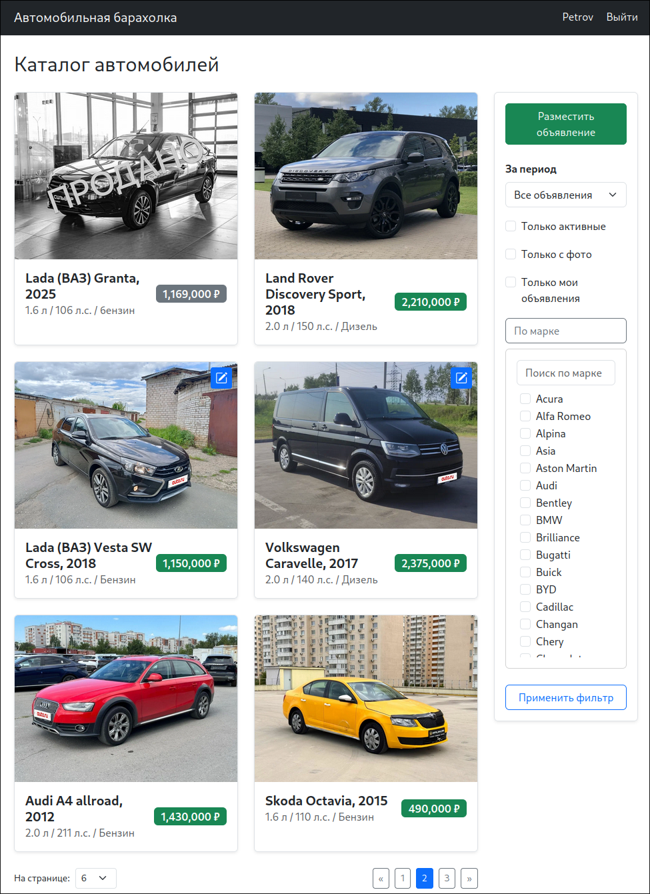
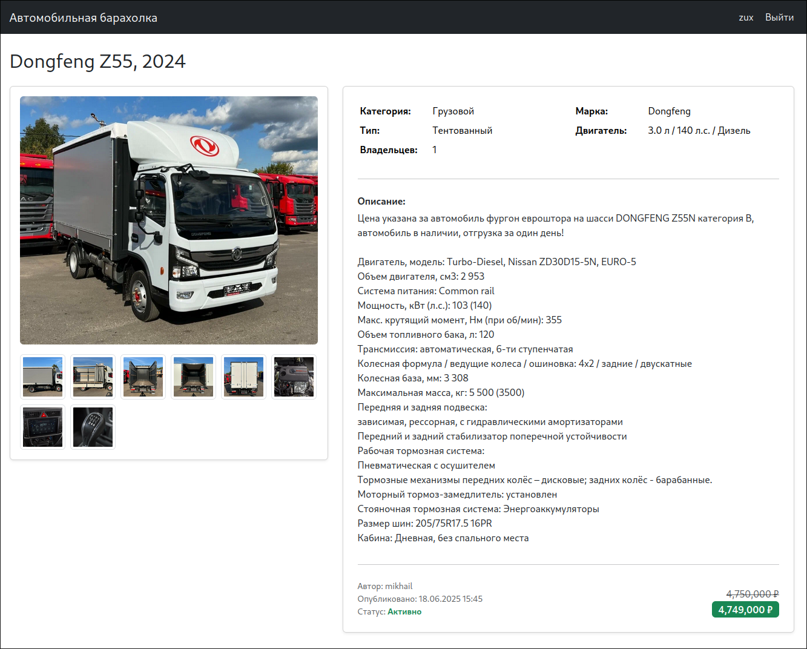
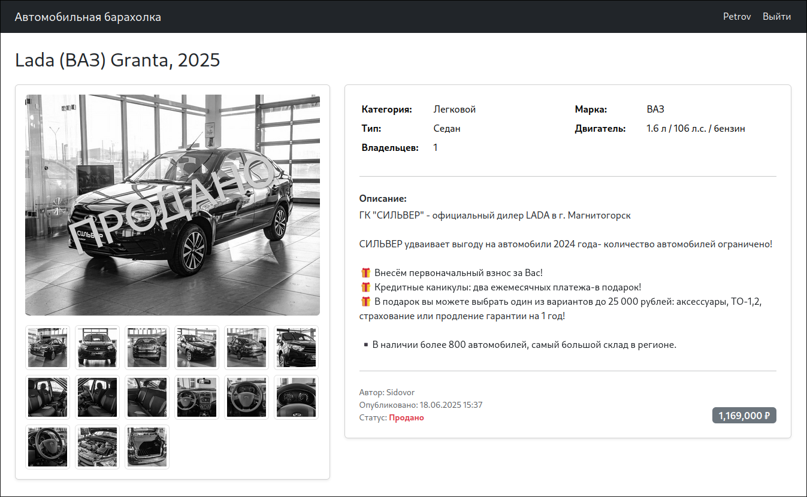
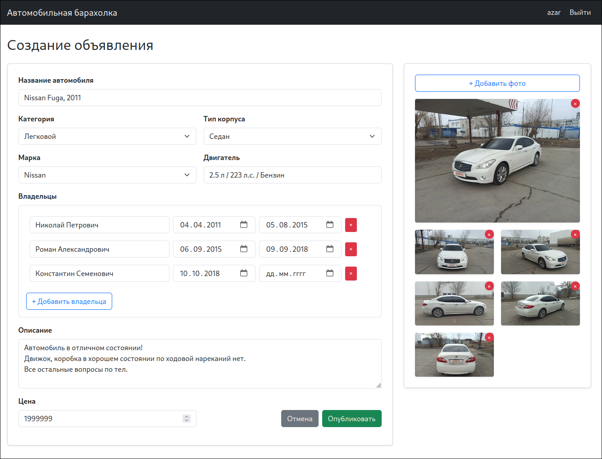
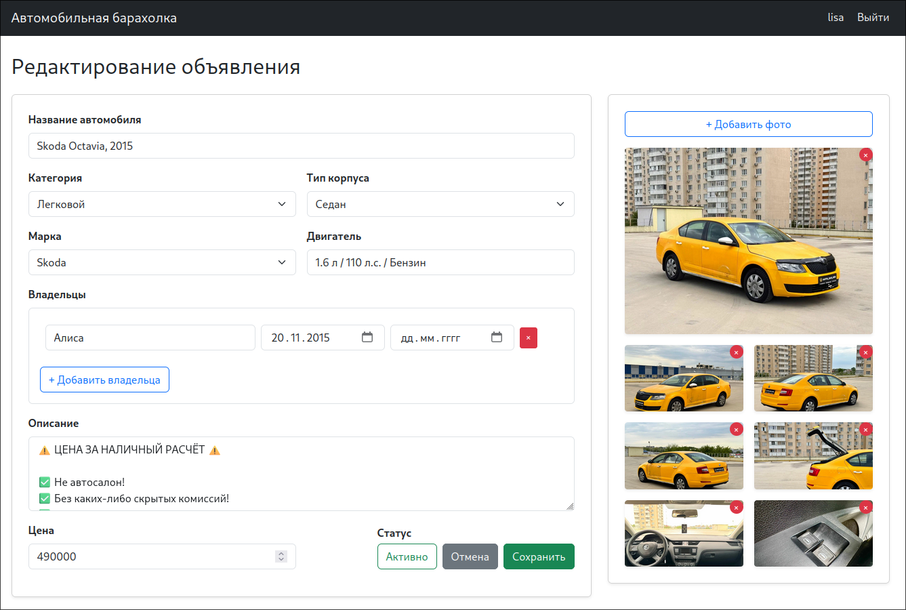

# job4j_cars — Автомобильная барахолка

### 📦 Стек технологий:

- Spring Boot 3.5
- Thymeleaf 3.1.3
- Hibernate ORM 7.0
- Liquibase 4.31.3
- Lombok 1.18.38
- Bootstrap 5.3.6
- MariaDB / H2 (для тестов)

---

## 📋 Описание

Веб-приложение для размещения и поиска объявлений о продаже автомобилей.  
Пользователи могут добавлять машины, прикреплять фото, просматривать объявления, фильтровать и редактировать свои публикации.

---

## 🔧 Основной функционал

- Просмотр всех объявлений с пагинацией
- Фильтрация:
    - по периоду публикации
    - по марке автомобиля
    - только с фото
    - только активные (не проданные)
    - только свои объявления
- Добавление нового объявления
    - Загрузка одного или нескольких фото
- Редактирование объявления
    - Смена статуса на "продано"
    - Изменение цены
    - Добавление/удаление владельцев

---

## ⭐ Особенности

- Валидация периодов владения на клиенте
  - Пересечение интервалов
  - Только один открытый интервал
  - Хотя бы один владелец
- Каскадный выбор типа корпуса, в зависимости от выбранной категории
- Модальные окна для просмотра изображений на страницах:
  - Просмотра
  - Добавления
  - Редактирования

---

## 🧱 Архитектура

Проект разделён на три слоя:

- `controller` — обработка HTTP-запросов и форм
- `service` — бизнес-логика
- `store` — работа с БД через Hibernate

Также используются DTO.

---

## 🚀 Сборка и запуск

1. Убедитесь, что у вас установлен MariaDB (или MySql) и создана база данных `cars`.
2. Пропишите параметры подключения в `src/main/resources/application.properties` или используйте переменные окружения:
    ```
    spring.datasource.url=jdbc:mariadb://localhost:3306/cars
    spring.datasource.username=your_user
    spring.datasource.password=your_pass
    ```
3. Соберите проект:
    ```bash
    mvn clean package
    ```

4. Запустите приложение:
    ```bash
    mvn spring-boot:run
    ```

---

## 💻 Интерфейс

### Главная страница
>Список объявлений с фото, ценой и фильтрами



### Карточка авто
>Все фото в карточке кликабельны и доступны для просмотра в модальном окне



### Карточка проданного авто
>Добавляется вотермарка "Продано", меняется стиль фото и цены на ЧБ



### Добавление объявления
>Выбор марки, модели, типа кузова, указание владельцев, прикрепление фото



### Редактирование объявления
>Возможность смены статуса, изменения цены, добавления/удаления фото и владельцев


